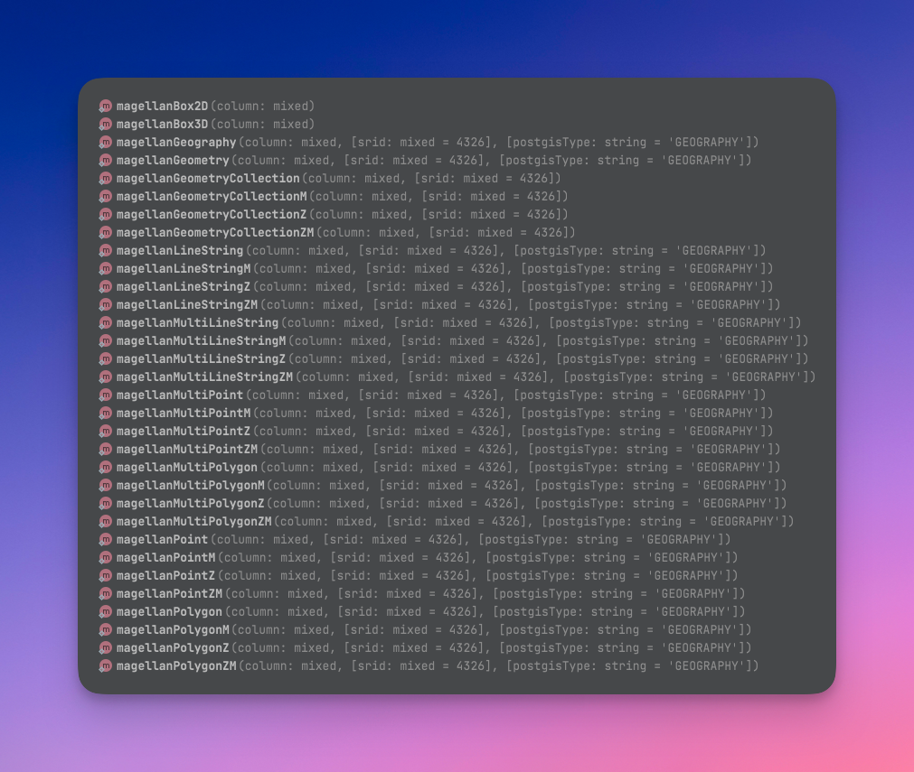

<div align="center">
    <br>
    <br>
    <br>
    <br>
    <picture>
        <source media="(prefers-color-scheme: dark)" srcset="art/logo_dark.svg">
        <source media="(prefers-color-scheme: light)" srcset="art/logo_light.svg">
        
    </picture>
    <br>
    <br>
    <p style="font-size: 1.75rem;">A modern PostGIS toolbox for Laravel</p>
    <br>

[](https://packagist.org/packages/clickbar/laravel-magellan)
[](https://packagist.org/packages/clickbar/laravel-magellan)
[](https://github.com/clickbar/laravel-magellan/actions/workflows/run-tests.yml)
[](https://github.com/clickbar/laravel-magellan/actions/workflows/fix-styling.yml)
<br>
<br>
</div>

## Introduction

Every sailor needs a nice ship to travel the seven seas ⛵️

This package will have you prepared for accessing [PostGIS](https://postgis.net) related functionality within Laravel.
It was heavily inspired by [mstaack/laravel-postgis](https://github.com/mstaack/laravel-postgis), but has evolved into
much more since. Other than some slight changes, you should be familiar with Magellan very quickly.

Magellan comes with batteries included and also provides parsers/generators for GeoJSON, WKB & WKT out of the box.
Easily use all PostGIS datatypes in your migrations and avoid raw SQL to access PostGIS functions by using our Builder
functions.

Additionally `laravel-magellan` provides extensions to the Schema, Query Builder and Postgres Grammar for easy access of
PostGIS database functions like `ST_EXTENT`. It does all this without breaking compatibility to other packages,
like [tpetry/laravel-postgresql-enhanced](https://github.com/tpetry/laravel-postgresql-enhanced), which has to extend
the Grammar and Connection.

## Installation

You can install the package via composer:

```bash
composer require clickbar/laravel-magellan
```

You can publish and run the migrations with:

```bash
php artisan vendor:publish --tag="magellan-migrations"
php artisan migrate
```

You can publish the config file with:

```bash
php artisan vendor:publish --tag="magellan-config"
```

You may find the contents of the published config file here:
[config/magellan.php](config/magellan.php)

## What's included

- [x] Migration Schema Blueprints
- [x] Geometry Data Classes
- [x] WKT Generator & Parser
- [x] WKB Generator & Parser
- [x] Geojson Generator & Parser
- [x] Eloquent Model Trait
- [x] Command for automatically adding postgis trait to models
- [x] Auto Transform on insert with different projection
- [x] Geojson Request Validation Rule
- [x] Transforms Geometry for Form Requests
- [x] Most of Postgis functions as typed functions that can be used in select, where, orderBy, groupBy, having, from
- [x] Geometry and Bbox Caster
- [x] Auto Cast when using functions that return geometry or bbox
- [x] Empty Geometry Support
- [ ] Automatic Postgis Function Doc Generator
- [ ] Bbox also with postgisColumns trait (currently with cast only)
- [ ] Custom Geometry Factories & Models
- ...

## Before you start

We highly recommend using the [laravel-ide-helper](https://github.com/barryvdh/laravel-ide-helper) from barryvdh to be
able to see everything included in the IDEs auto completion.

## Creating Tables with Postgis Columns

Laravel-magellan extends the default Schema Blueprint with all postgis functions. Since laravel has introduced basic
geometry support, all methods are prefixed with `magellan`. e.g.

```php
$table->magellanPoint('location', 4326, 'GEOMETRY');
```



## Preparing the Model

In order to properly integrate everything with the model you need to to perform the following 2 steps:

1. Add the `HasPostgisColumns` trait to your model
2. Add the `$postgisColumns` array to the model

```php
protected array $postgisColumns = [
        'location' => [
            'type' => 'geometry',
            'srid' => 4326,
        ],
    ];
```

Both steps can be automated by using the following command:

```bash 
php artisan magellan:update-postgis-columns
```

The command automatically scans the database and adds the trait and the array as well.

## Using the geometry data classes

We've included data classes for the following common geometries:

- Point
- LineString
- Polygon
- MultiPoint
- MultiLineString
- MultiPolygon
- GeometryCollection

To create a geometry object manually use the suited `<GeometryClass>::make` method. e.g.

```php
$point = Point::make(51.087, 8.76);
```

You will notice, that there are 3 different make methods for the point class with different parameters:

1. make
2. makeGeodectic
3. makeEmpty

Let's take a closer look to the first two:

This is the default factory method, that can be used to fill all possible values. This method is considered the "plain"
way. You should consider using this method when you use a different projection than WGS84 (srid=4326).

```php
function make(float $x, float $y, ?float $z = null, ?float $m = null, ?int $srid = null): self
```

Most of the common web use cases use the WGS84 projection. Therefore, most of the time the terms that are used will be
latitude, longitute and altitude instead of x, y and z. To provide more comfort we have included a factory method, that
accepts those terms and automatically sets the srid to 4326.

```php
function makeGeodetic(float $latitude, float $longitude, ?float $altitude = null, ?float $m = null): self
```

When using a point class that uses the WGS84 projection, you can access the latitude, longitude and altitude with
properly named getters and setters:

- `function getLatitude(): float`
- `function setLatitude(float $latitude): void`
- `function getLongitude(): float`
- `function setLongitude(float $longitude): void`
- `function getAltitude(): ?float`
- `function setAltitude(float $altitude): void`

An exception will be thrown if you try to use this functions on a point without srid === 4326. Use the default x,y,z,m
getters and setters instead.

## Request Validation and Transformation

When a form request contains a geometry in Geojson format, you can use the `GeometryGeojsonRule` for validation. You can
even limit the types of allowed geometries by passing an array with the classes.

In order to properly continue working with the received geometry you can use the `TransformsGeojsonGeometry` trait to
use automatic transformation of the geojson to the proper geometry object. Therefore, return the keys in
the `geometries(): array` function.

> **Note**
> Currently nested transformation is not supported

```php
class StorePortRequest extends FormRequest
{
    use TransformsGeojsonGeometry;

    public function rules(): array
    {
        return [
            'name' => ['required', 'string'],
            'country' => ['required', 'string'],
            'location' => ['required', new GeometryGeojsonRule([Point::class])],
        ];
    }

    public function geometries(): array
    {
        return ['location'];
    }
}
```

## Running queries

A big part of laravel-magallan is its query feature. To provide a seemless and eady use of postgis functions, we have
included a wide scope of the typically ST_xxx functions that can directly be used with Laravels query builder.

Whenever you want to use a postis function on a query builder, you have to use one of our main methods. All of them are
prefixed with an `st`. Currently, there are the following 7:

- stSelect
- stWhere
- stOrWhere
- stOrderBy
- stGroupBy
- stHaving
- stFrom

Each of those builder methods expect to receive a _MagellanExpression_. A _MagellanExpression_ represents a typical
ST_Blabla function from postgis. When sailing with magellan, you should never write a 'ST_Blabla' yourself. Therefore,
we have included some paddles.

Most of the ST_Blabla functions can be found using the static functions on the `ST` class. But enough talk, let's start
sailing (with some examples):

Considerung we have the following model:

```php
class Port extends Model
{
    use HasFactory;
    use HasPostgisColumns;

    protected $guarded = [];

    protected array $postgisColumns = [
        'location' => [
            'type' => 'geometry',
            'srid' => 4326,
        ],
    ];
}
```

Created by the following migration:

```php
 Schema::create('ports', function (Blueprint $table) {
            $table->id();
            $table->string('name');
            $table->string('country');
            $table->magellanPoint('location', postgisType: 'GEOMETRY');
            $table->timestamps();
        });
```
Let's query all the available ports with their current distance:
```php
$currentShipPosition = Point::makeGeodetic(50.107471773560114, 8.679861151457937);
$portsWithDistance = Port::select()
            ->stSelect(ST::distanceSphere($currentShipPosition, 'location'), 'distance_to_ship')
            ->get();
```

Since we cannot sail over the whole world, let's limit the distance to max. 50.000 meters:
```php
$currentShipPosition = Point::makeGeodetic(50.107471773560114, 8.679861151457937);
$portsWithDistance = Port::select()
            ->stSelect(ST::distanceSphere($currentShipPosition, 'location'), 'distance_to_ship')
            ->stWhere(ST::distanceSphere($currentShipPosition, 'location'), '<=', 50000)
            ->get();
```
Now let us order them based on the distance:
```php
$currentShipPosition = Point::makeGeodetic(50.107471773560114, 8.679861151457937);
$portsWithDistance = Port::select()
            ->stSelect(ST::distanceSphere($currentShipPosition, 'location'), as: 'distance_to_ship')
            ->stWhere(ST::distanceSphere($currentShipPosition, 'location'), '<=', 50000)
            ->stOrderBy(ST::distanceSphere($currentShipPosition, 'location'))
            ->get();
```
You see, using the `st`-Builder functions is as easy as using the default laravel ones. 
But what about some more complex queries?
What about the convex hull of all ports grouped by the country they lay in including the area of the hull?
No problem:
```php
$hullsWithArea = Port::select('country')
            ->stSelect(ST::convexHull(ST::collect('location')), 'hull')
            ->stSelect(ST::area(ST::convexHull(ST::collect('location'))))
            ->groupBy('country')
            ->get();
```
## Testing

```bash
composer test
```

## Changelog

Please see [CHANGELOG](CHANGELOG.md) for more information on what has changed recently.

## Contributing

Please see [CONTRIBUTING](CONTRIBUTING.md) for details.

## Security Vulnerabilities

If you discover any security related issues, please email [security@clickbar.dev](mailto:security@clickbar.dev) instead
of using the issue tracker.

## Thanks

- [geo-io](https://github.com/geo-io)
- [mstaack/laravel-postgis](https://github.com/mstaack/laravel-postgis)
- [jmikola/geojson](https://github.com/jmikola/geojson)
- [jsor/doctrine-postgis](https://github.com/jsor/doctrine-postgis)

## Credits

- [Adrian](https://github.com/ahawlitschek)
- [saibotk](https://github.com/saibotk)
- [All Contributors](../../contributors)

## License

The MIT License (MIT). Please see [License File](LICENSE.md) for more information.
